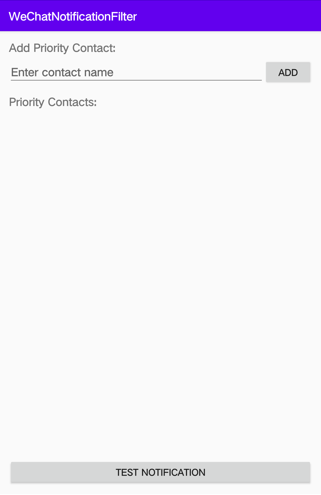

# WeChatNotificationFilter

An Android application that filters WeChat notifications and allows you to set custom notification sounds for priority contacts.

## Overview

WeChatNotificationFilter helps manage the overwhelming number of WeChat notifications by allowing you to:

- Define a list of priority contacts
- Set custom notification sounds for each priority contact
- Keep notifications from non-priority contacts silent
- Maintain your focus by only receiving audible alerts from important contacts

## Features

- **Priority Contact Management**: Add, remove, and manage your list of priority contacts
- **Custom Notification Sounds**: Set unique notification sounds for each contact
- **Notification Filtering**: Automatically filter incoming WeChat notifications based on your preferences
- **Test Functionality**: Test your notification settings directly from the app

## Demo Video

Click the screenshot below to watch a demonstration of the app in action:

[](https://drive.google.com/file/d/1-5jfIMjwRMneXZEf2buRRXeqC71NSY_A/view?usp=sharing)

## Requirements

- Android 7.0 (API level 24) or higher
- WeChat app installed on your device
- Notification access permission

## Installation

1. Download the APK from the [Releases](https://github.com/YourUsername/WeChatNotificationFilter/releases) section
2. Install the APK on your Android device
3. Open the app and grant notification access permission when prompted
4. Add your priority contacts and customize their notification sounds

## Usage

### Setting Up Priority Contacts

1. Launch the app
2. Enter a contact name in the input field
3. Tap "Add" to add the contact to your priority list
4. Long-press on a contact name to remove it from the list

### Setting Custom Notification Sounds

1. Tap on any contact in your priority list
2. Select a notification sound from the system sound picker
3. The selected sound will be used for notifications from this contact

### Testing Notifications

1. Add at least one priority contact
2. Tap the "Test Notification" button
3. A test notification will be generated for the first contact in your list

## How It Works

The app uses Android's `NotificationListenerService` to intercept WeChat notifications. When a notification from WeChat is detected, the app:

1. Checks if the sender is in your priority contacts list
2. If it's a priority contact, recreates the notification with the custom sound you selected
3. If it's not a priority contact, recreates the notification without sound

The original WeChat notification is canceled to prevent duplicates.

## Permissions

- **BIND_NOTIFICATION_LISTENER_SERVICE**: Required to intercept and filter notifications
- **FOREGROUND_SERVICE**: Required to run the notification listener service
- **POST_NOTIFICATIONS**: Required to post modified notifications

## Building from Source

1. Clone this repository
   ```
   git clone https://github.com/YourUsername/WeChatNotificationFilter.git
   ```

2. Open the project in Android Studio

3. Build the project
   ```
   ./gradlew assembleDebug
   ```

4. Install on your device
   ```
   ./gradlew installDebug
   ```

## Contributing

Contributions are welcome! Please feel free to submit a Pull Request.

1. Fork the repository
2. Create your feature branch (`git checkout -b feature/amazing-feature`)
3. Commit your changes (`git commit -m 'Add some amazing feature'`)
4. Push to the branch (`git push origin feature/amazing-feature`)
5. Open a Pull Request

## TODO

- [ ] Group chat filtering
- [ ] Time-based filtering (quiet hours)
- [ ] Regular expression support for contact matching
- [ ] Backup and restore settings

## License

This project is licensed under the Apache 2.0 License - see the [LICENSE](LICENSE) file for details.

## Acknowledgments

- Thanks to the Android developer community
- Inspired by the need to manage notification overload from WeChat